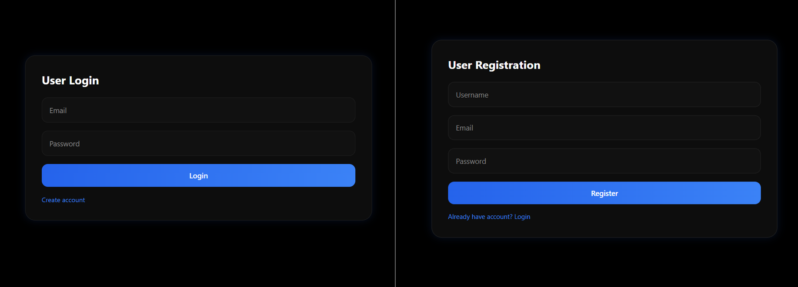
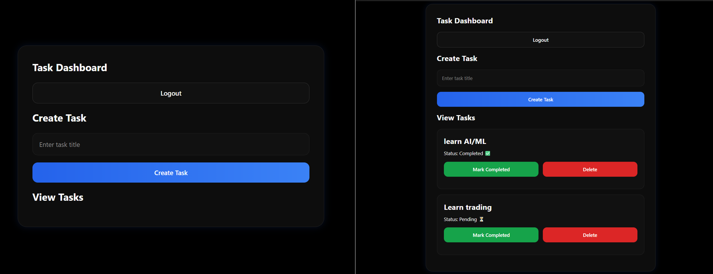
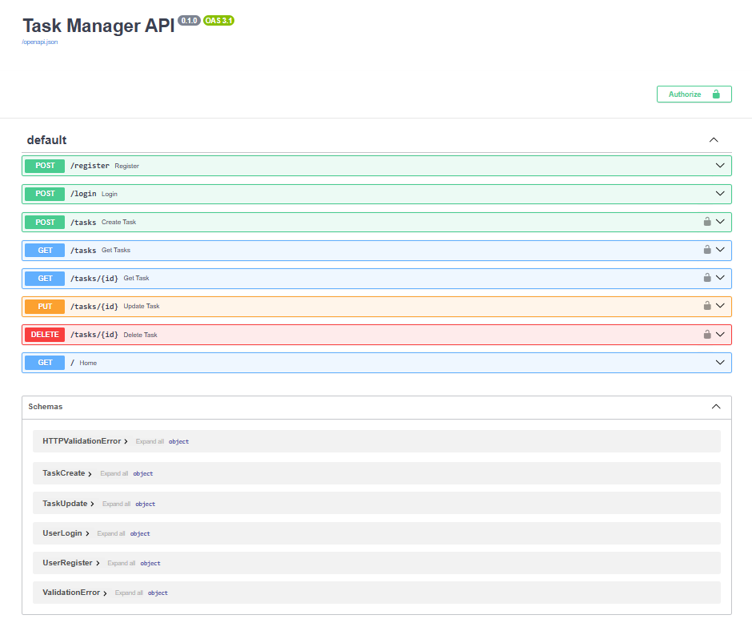

#  FastAPI Task Manager

A full-stack **Task Manager Web Application** built using **FastAPI**, **JWT Authentication**, **SQLite**, and a frontend developed with **HTML, CSS, and JavaScript**.

This project was developed as an internship assignment focusing on:

- Backend development
- Authentication & Authorization
- Database integration
- Frontend integration
- Docker containerization
- Testing

---

# Features

## Authentication

- User Registration  

- User Login  

- JWT Authentication  

- Password Hashing using bcrypt  

---

##  Task Management

Authenticated users can:

- Create Tasks  

- View Tasks  

- View Specific Task  

- Mark Tasks as Completed  

- Delete Tasks  

Users can access **only their own tasks**.

---

##  Additional Features

### Pagination Support

Example:

```http
GET /tasks?page=1&limit=5
```

### Task Filtering

Example:

```http
GET /tasks?completed=true
```

Additional features:

- Docker Support  

- Unit Testing using pytest  

- Responsive Frontend UI  

---

#  Tech Stack

## Backend

- FastAPI
- SQLAlchemy
- SQLite
- JWT Authentication
- Passlib bcrypt
- Pydantic
- Pytest

## Frontend

- HTML
- CSS
- JavaScript

## Deployment

- Docker
- Render
- Vercel

---

#  Project Structure

```text
FastAPI-Task-Manager/

├── backend/
│
│   ├── app/
│   │
│   ├── models/
│   ├── routes/
│   ├── schemas/
│   ├── services/
│   ├── utils/
│   │
│   ├── database.py
│   ├── dependencies.py
│   └── main.py
│
│
├── tests/
│   ├── conftest.py
│   └── test_auth.py
│
├── Dockerfile
├── requirements.txt
└── .env.example
│
├── frontend/
│   ├── register.html
│   ├── login.html
│   ├── dashboard.html
│   ├── app.js
│   └── style.css
│
├── screenshots/
│   ├── auth.png
│   ├── dashboard.png
│   └── swagger.png
│
└── README.md
```

---

#  Environment Variables

Create:

```text
backend/.env
```

Example:

```env
DATABASE_URL=sqlite:///task.db

SECRET_KEY=your_secret_key_here
```

Example template:

```text
backend/.env.example
```

```env
DATABASE_URL=sqlite:///task.db

SECRET_KEY=your_secret_key_here
```

---

#  Run Locally

## Backend

Move to backend:

```bash
cd backend
```

Run server:

```bash
uvicorn app.main:app --reload
```

Backend API:

```text
http://127.0.0.1:8000
```

Swagger API Docs:

```text
http://127.0.0.1:8000/docs
```

---

## Frontend

Move to frontend:

```bash
cd frontend
```

Run:

```bash
python -m http.server 5500
```

Open:

```text
http://localhost:5500/login.html
```

---

#  Docker

Build Docker image:

```bash
docker build -t taskmanager .
```

Run container:

```bash
docker run -d -p 8000:8000 --name taskapp taskmanager
```

Check logs:

```bash
docker logs taskapp
```

Check running containers:

```bash
docker ps
```

Stop container:

```bash
docker stop taskapp
```

Remove container:

```bash
docker rm taskapp
```

Docker verified successfully.

---

#  Testing

Run tests:

```bash
pytest
```

Expected output:

```text
1 passed
```

---

#  API Endpoints

## Authentication

```http
POST /register

POST /login
```

## Tasks

```http
POST /tasks

GET /tasks

GET /tasks/{id}

PUT /tasks/{id}

DELETE /tasks/{id}
```

---

# Screenshots

## Authentication



---

## Dashboard



---

## Swagger API



---

# Deployment

Backend Deployment:

Render

https://fastapi-task-manager-jhuh.onrender.com

Frontend Deployment:

Vercel


API Docs:

```text
https://fastapi-task-manager-jhuh.onrender.com/docs
```

---


# Author

**Nagarajan S**

MCA Graduate | Python Developer

GitHub:

https://github.com/nagasakthi
